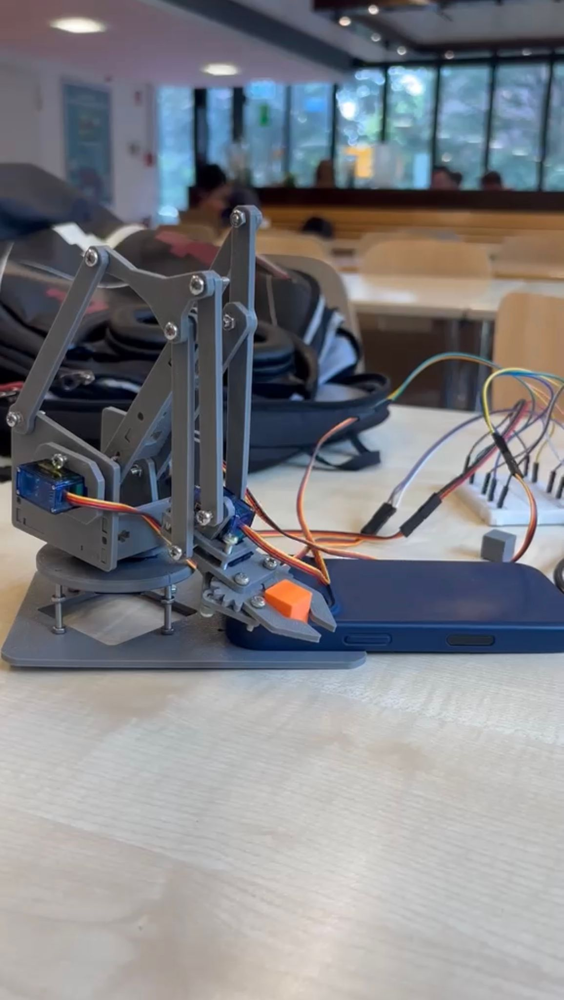
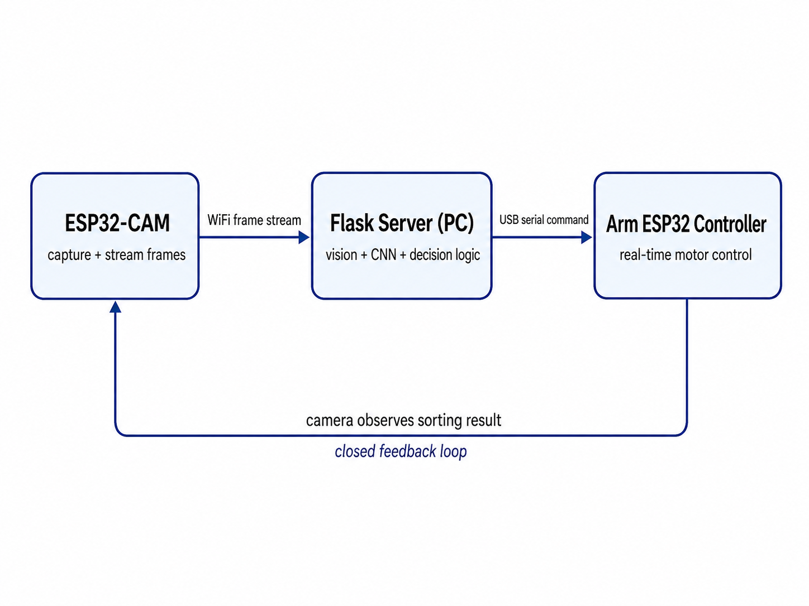

# 🤖 Vision-Guided Cube-Sorting Robot

> A real-time computer-vision pipeline and robotic arm that **sees a colored cube, classifies it with a neural network, and physically sorts it into the correct bin** — fully autonomously.

<p align="center">
  
</p>


---

## Overview

This project is an end-to-end **autonomous sorting system** built from scratch — spanning embedded firmware, wireless networking, a deep-learning inference service, and real-time control of a physical robotic arm.

A camera watches a pickup zone, a convolutional neural network identifies each cube's color, and a 4-degree-of-freedom arm executes a full pick-and-place routine to drop the cube in its matching bin. Everything runs in a closed loop with no human in the loop.

It brought together skills across **machine learning, computer vision, distributed systems, and embedded engineering** into one working device.

---

## What this project demonstrates

- **Deep learning** — designed and trained a compact CNN (TensorFlow/Keras) for real-time image classification on a custom-collected, **2,900-image** dataset.
- **Computer vision** — built a multi-stage object-localization pipeline in OpenCV (edge-contour detection → HSV color segmentation → graceful fallback) so the model only ever sees a clean crop of the cube.
- **Distributed/embedded systems** — designed a 3-node architecture where a wireless camera, an inference server, and a microcontroller communicate over **HTTP and USB serial** in real time.
- **Embedded firmware (C++)** — wrote firmware for two ESP32 boards: image capture/streaming on an ESP32-CAM, and smooth, safety-limited servo control on the arm.
- **Robustness engineering** — added a temporal stability filter, a per-class confidence threshold, a brightness-based disambiguation heuristic, and a command cooldown to make the system reliable under real-world noise.
- **Hardware integration** — assembled and calibrated a 3D-printed 4-servo arm, deriving tested angle limits to protect the mechanism.

---

## System architecture

<p align="center">
  
</p>

The system is three cooperating nodes in a closed feedback loop. The **ESP32-CAM** captures frames and streams them to the server over WiFi. The **Flask server** (on a PC) does the heavy lifting — locating and cropping the cube, classifying its color with the CNN, and deciding when to act. The **arm's ESP32** receives a single-byte command over USB serial and runs the physical sorting motion, which the camera then sees, closing the loop. Splitting the work this way lets each device do only what it's best at: capture, vision/ML, and real-time motor control.
 
**Step by step:** the camera streams a frame → the server localizes and classifies the cube (gray / orange / black) → a label is accepted only after three consecutive agreeing frames → the server sends the matching command (with an 8-second cooldown so a cube is never sorted twice) → the arm reaches, grips, lifts, rotates to the correct bin, releases, and returns home.

---

## Tech stack

| Layer            | Technologies                                             |
|------------------|----------------------------------------------------------|
| Machine learning | TensorFlow · Keras (custom CNN)                          |
| Computer vision  | OpenCV (contour + HSV segmentation, preprocessing)       |
| Backend / API    | Python · Flask REST endpoint · multithreading            |
| Embedded         | C++ · ESP32 · ESP32-CAM · ESP32Servo · PySerial bridge   |
| Hardware         | 3D-printed 4-DOF arm · 4× servo motors                   |

---

## Engineering highlights

A few decisions that took this from "demo that works once" to "system that works repeatedly":

- **Three-tier object localization.** Rather than feeding raw frames to the model, the server tries edge-contour detection first, falls back to HSV color masking, and finally to a center crop — so the classifier always receives a focused, consistently-framed input.
- **Temporal stability filter.** A 3-frame voting buffer means a single noisy prediction can't fire the arm; only a sustained, agreeing signal does.
- **Class-aware thresholds + brightness heuristic.** Dark and gray cubes are visually similar, so a lower confidence bar and a brightness check disambiguate the hardest case.
- **Action cooldown.** An 8-second lockout prevents the arm from re-sorting a cube that's still in view.
- **Firmware-level safety limits.** Every servo target is hard-constrained to a tested safe range, so no command — buggy or malicious — can drive the arm past its mechanical limits.

---

## Repository structure

```
.
├── ESP32CAM/ESP32CAM.ino    # Camera firmware — capture & stream frames
├── cube_sorter/cube_sorter.ino  # Arm firmware — receive commands, drive servos
├── predict_sever.py         # Flask inference server (CNN + CV pipeline)
├── detection_model.h5       # Trained Keras CNN (96×96×3 → 3 classes)
└── annotations.json         # COCO-format dataset (2,900 images, 6,980 labels)
```

---

## The model

A compact CNN built for fast inference on modest hardware:

- **Input:** 96×96 RGB, normalized to `[0, 1]`
- **Body:** 3 × (`Conv2D → BatchNorm → MaxPool`) → `Flatten → Dense → Dropout`
- **Output:** `Dense(3, softmax)` → gray / orange / black
- **Trained on:** a custom 2,900-image dataset captured by the ESP32-CAM and labeled in COCO format

---

## Possible extensions

- Replace the classifier with an on-device object detector to localize and sort multiple cubes per frame
- Add inverse kinematics for arbitrary pickup positions instead of a fixed pickup point
- Stream the live annotated feed to a web dashboard

---

<p align="center"><i>Built as an end-to-end exploration of applied ML, computer vision, and robotics.</i></p>
